# 租房屋租赁带万字论文

### 介绍

房屋出租系统/房屋租赁网站

开发语言：java

运行环境:idea或eclipse 数据库:mysql

技术栈：spring 、spring MVC 、mybatis、jsp

两个角色:用户、管理员

### 万字论文

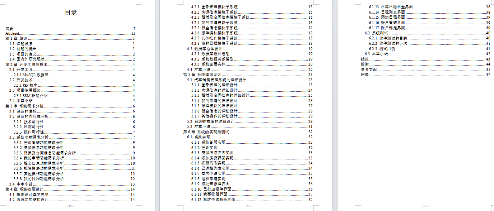

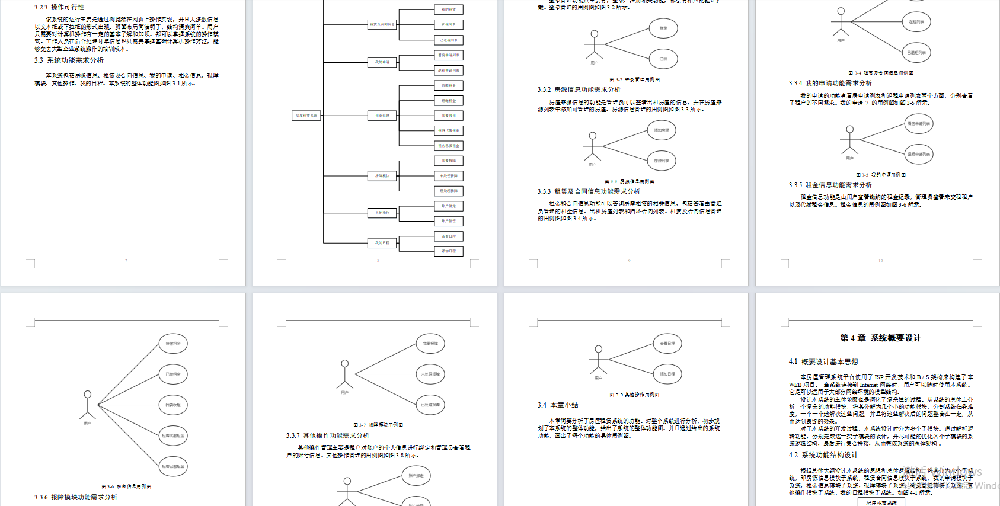

### 完整项目获取

通过网盘分享的文件：ssm房屋租赁

链接: https://pan.baidu.com/s/1ovy-UNeoN46U89eBBpcTNg?pwd=ya6c 提取码: ya6c
--来自百度网盘超级会员v3的分享

通过网盘分享的文件：工具包

链接: https://pan.baidu.com/s/1YmdoJvkjoUjA75wvHLDZ6A?pwd=xm96 提取码: xm96
--来自百度网盘超级会员v3的分享

需要远程项目部署或项目修改和毕业设计也可联系（添加申请时请备注好来意）

通过网盘分享的文件：远程调试部署联系方式

链接: https://pan.baidu.com/s/1W0dDcoZmayG0c7USJDYBYg?pwd=nqd7 提取码: nqd7
--来自百度网盘超级会员v3的分享

### 项目合集(项目不断更新中)
链接: https://pan.baidu.com/s/1nY-zhvAK0CXYcn3g7LzQnQ?pwd=id3c 提取码: id3c
--来自百度网盘超级会员v3的分享

#### 这些项目一起发你了 可以分享给你需要的同学 调试可找我 也接二次修改和项目定制、毕业设计等

## 接毕业设计和论文

微信联系方式：xzxj0206  QQ：3808981644   (支持修改、 部署调试、 支持代做毕设)

接网站建设、小程序、H5、APP、各种系统等，单片机、嵌入式也可以做

选题+开题报告+任务书+程序定制+安装调试+论文+答辩ppt  都可以做

### 管理员端部分页面展示

1、房原列表  2、添加房源  3、在租列表  4、已退租列表  5、看房申请  

6、退租申请  7、待处理报障  8、已处理报障  9、我要收租  10、租客待缴租金  

11、租客已缴租金  12、查看日程  13、添加日程  14、账户管理

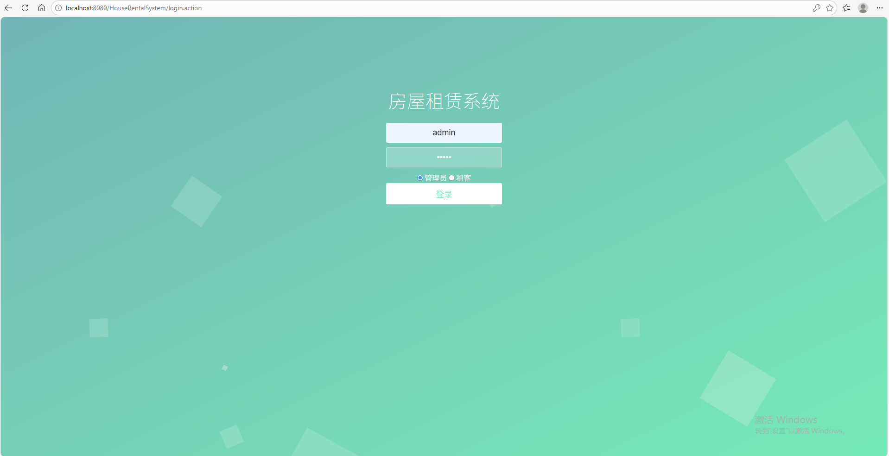

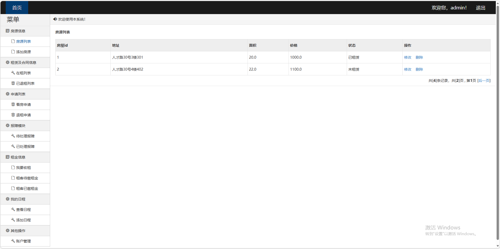

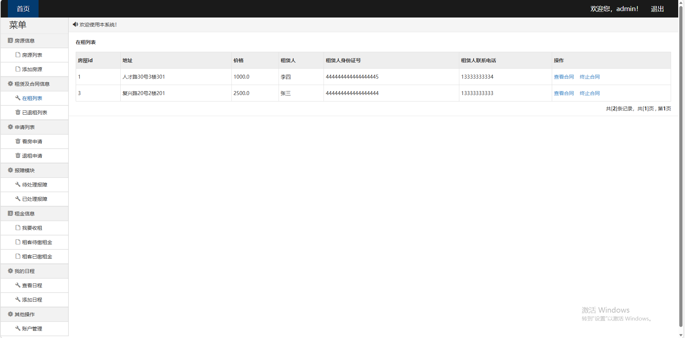

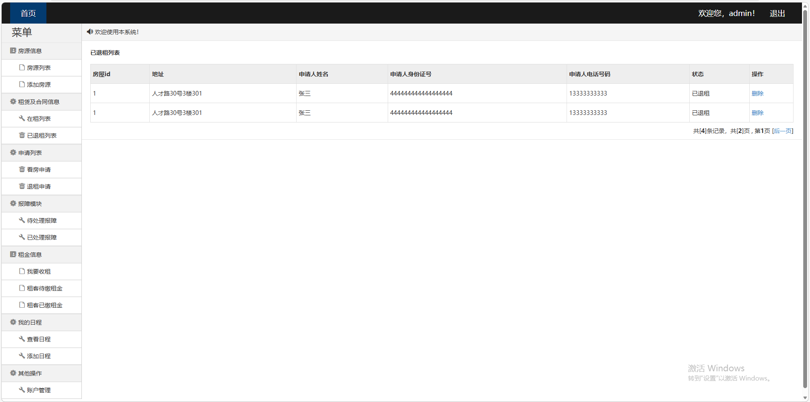

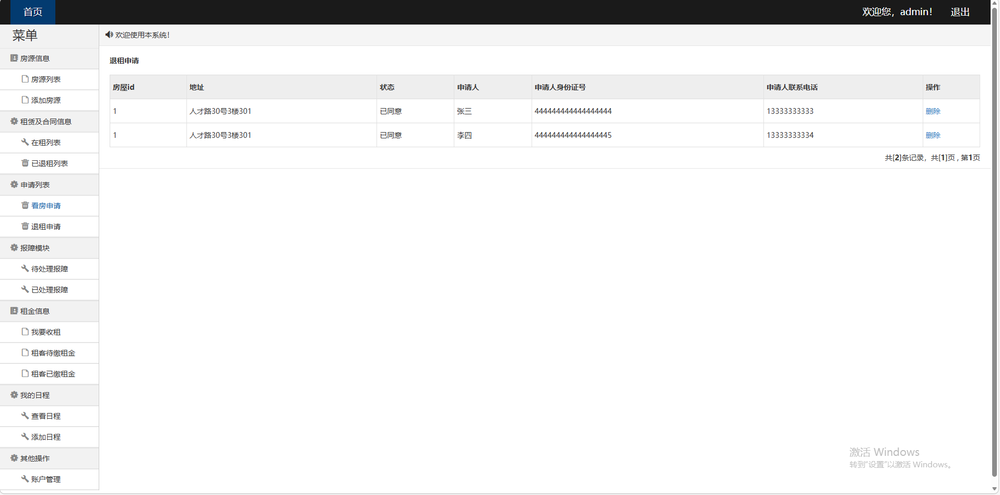

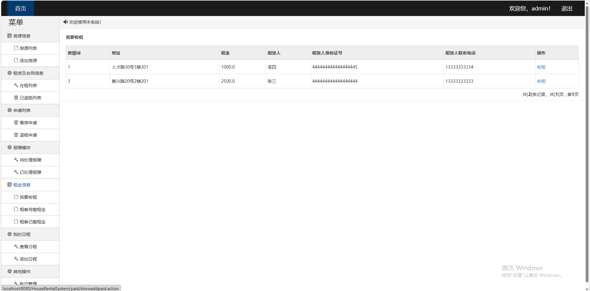

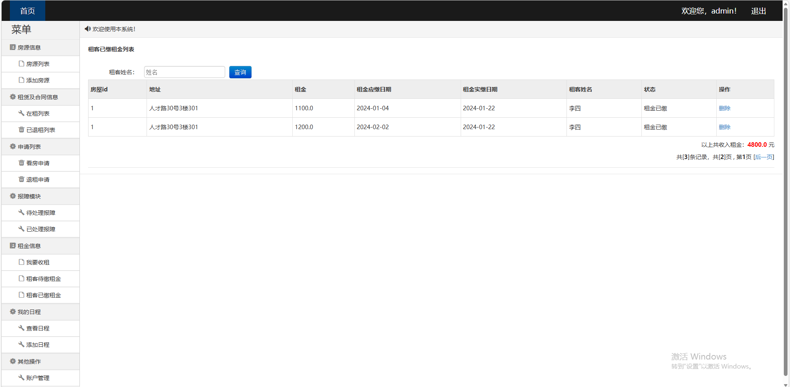

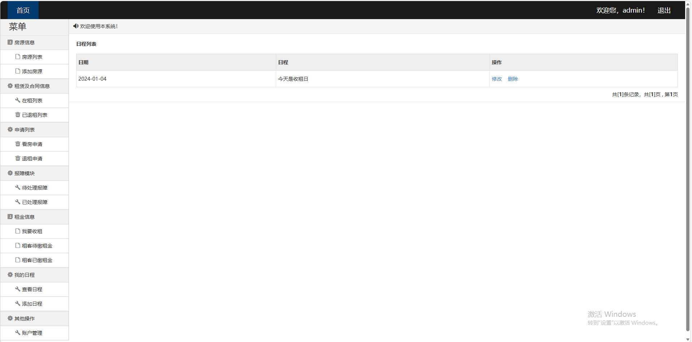

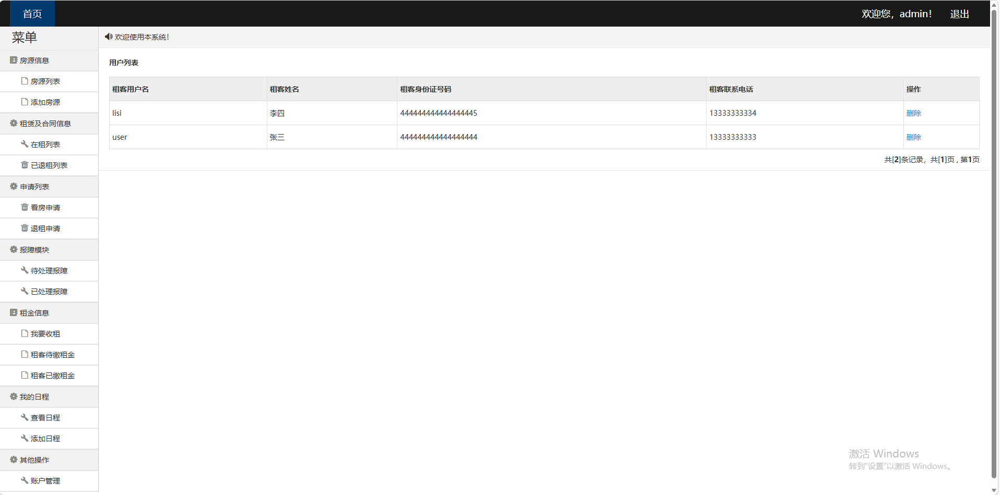

###  用户端部分页面展示

1、房源列表  2、我的租赁  3、已退租列表  3、看房申请列表  4、退租申请列表  5、待缴租金

6、已缴租金  7、我要报障  8、未处理报障  9、已处理报障  10、账户绑定

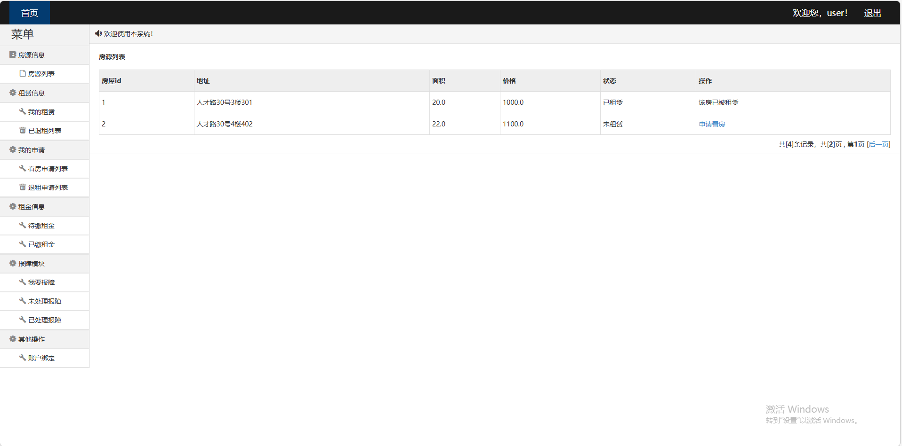

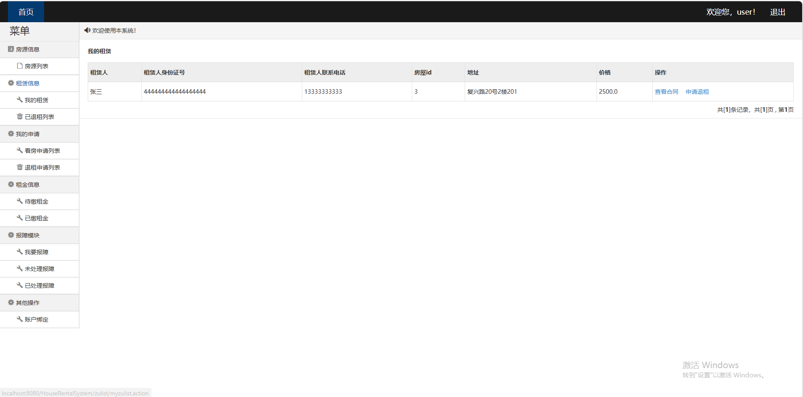

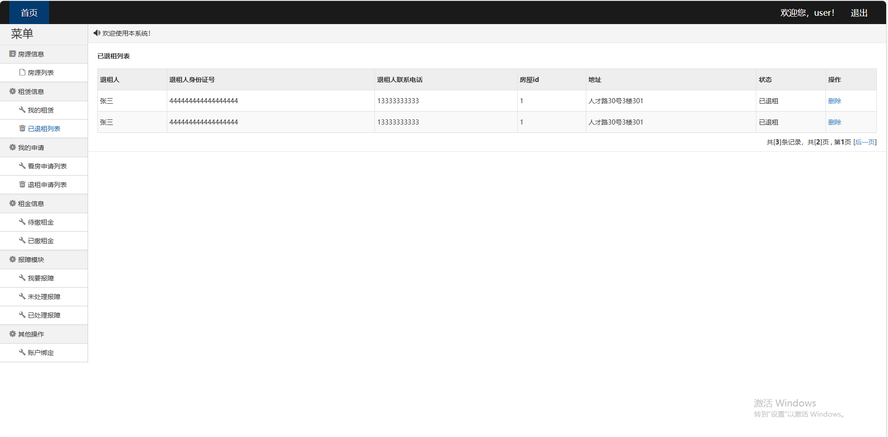

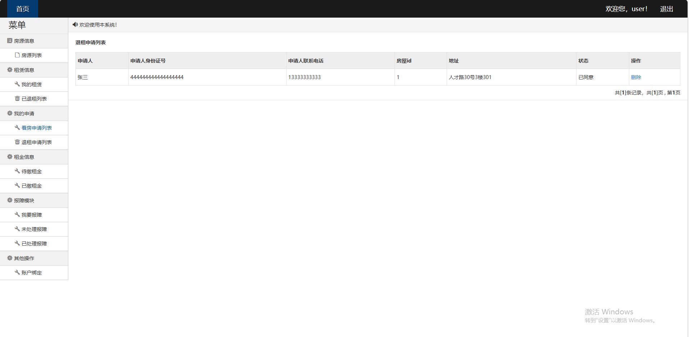

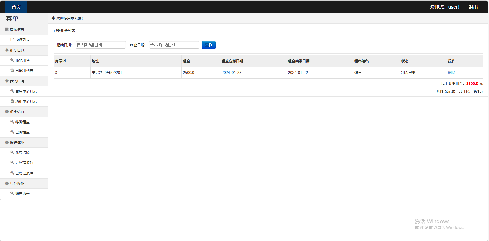

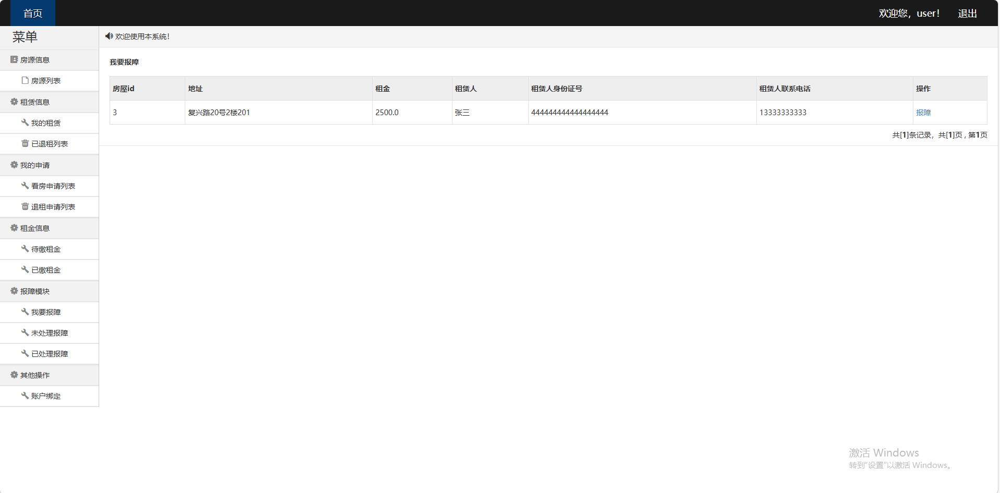

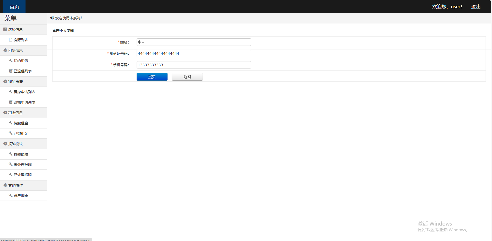

